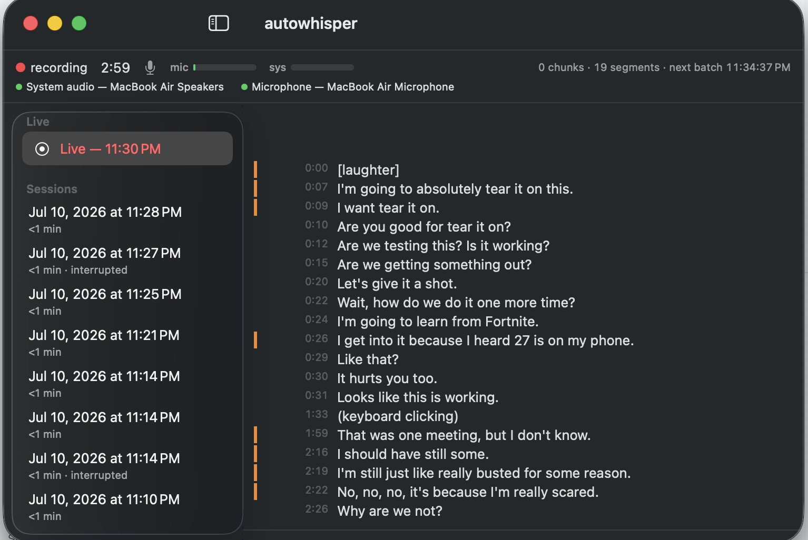

# autowhisper

A macOS menu-bar app that records your microphone and all system audio, then
turns them into a corrected transcript — locally, with your own Claude
subscription doing the final polish.



- **One-click capture** of everything you hear and say: system audio via a
  Core Audio process tap, microphone via AVAudioEngine, mixed to one track
- **Honest mic control** — the microphone toggle genuinely starts/stops the
  hardware, so the macOS orange indicator always tells the truth
- **Near-real-time transcription** streaming into the UI as you record
- **Two-model accuracy**: fast `base.en` drafts every segment with a
  confidence score; low-confidence spans are re-transcribed with
  `large-v3-turbo` and the `claude` CLI arbitrates the hypotheses
- **Tiny archives**: AAC-LC 16 kHz mono ≈ 12 MB/hour, 5-minute chunks,
  rolling 30-day audio retention — transcripts are kept forever
- **A real UI**: live meters and pipeline counters, Draft/Corrected views,
  transcript search, session search, rename/delete, copy/export

## How it works

```
mic (AVAudioEngine, on-demand) ─┐
                                ├─ mix @16 kHz ─┬─ ArchiveWriter → audio/*.m4a
system audio (Core Audio tap) ──┘               └─ Silero VAD windows
                                                      └─ whisper base.en → draft.jsonl
                                                            └─ flagged? large-v3-turbo → recheck.jsonl
                                                                  └─ claude -p (batched) → corrected.jsonl + transcript.md
```

Every stage writes to disk before publishing to the UI, so a crash never
shows you something the files don't have, and finished sessions replay
exactly what the live view showed.

## Requirements

- Apple Silicon Mac, macOS 26+
- Swift 6.3+ toolchain (Xcode command line tools suffice)
- [`claude` CLI](https://claude.com/claude-code) installed and logged in —
  optional: without it, correction is skipped and transcripts use the draft

## Build & install

```sh
Scripts/fetch-deps.sh            # whisper.cpp xcframework → .deps/
Scripts/make-app.sh --install    # build, bundle, sign, copy to /Applications
open /Applications/autowhisper.app
```

First launch: grant the microphone and system-audio-recording prompts.
Whisper models (~2 GB total) download to
`~/Library/Application Support/autowhisper/models/` on first recording.

Signing uses an Apple Development certificate when available, else ad-hoc —
fine locally, but ad-hoc builds may re-prompt permissions after rebuilds and
won't pass Gatekeeper on other machines.

## Privacy

This app records everything your Mac plays and (when the mic is on) hears.
Design choices that respect that:

- **Everything stays on disk locally** under
  `~/Library/Application Support/autowhisper/sessions/`. No telemetry, no
  cloud storage, no accounts.
- **The only network calls** are one-time model downloads and the correction
  pass, which sends *transcript text* (never audio) to Claude through your
  own logged-in CLI session.
- **Mic off means off** — the hardware is released, not software-muted.
- **Audio ages out** after the retention window (default 30 days,
  configurable); transcripts remain until you delete the session.
- Deleting a session from the sidebar removes audio and transcripts together.

Recording people requires their consent in many jurisdictions — that part is
on you.

## Usage

Start/stop recording and toggle the microphone from the menu-bar item.
"Open autowhisper…" shows the main window: status strip (levels, per-source
capture state, chunk/segment/backlog counters, correction progress), the
transcript in **Draft** (raw whisper, confidence flags) or **Corrected**
(Claude's fixes inline) view with search, and a day-grouped session list —
click a title to rename, right-click to reveal or delete, header button to
copy the transcript.

Session layout on disk:

```
session.json      metadata + status (recording | finished | interrupted)
audio/*.m4a       5-minute AAC chunks (purged after the retention window)
draft.jsonl       whisper draft segments with confidence
recheck.jsonl     large-model hypotheses for flagged segments
corrected.jsonl   Claude's corrections (audit trail)
transcript.md     final human-readable transcript (kept forever)
```

Settings (⌘, from the main window): launch at login, retention days,
re-check confidence threshold.

## Limitations

- No echo cancellation: with speakers (not headphones), the mic re-captures
  system audio. Harmless for transcription of the mixed track.
- Single mixed track — no speaker diarization; "who said what" is Claude's
  best guess from context.
- English models by default (`base.en`); swap model names in
  `ModelStore.swift` for multilingual.
- A crash forfeits the in-flight (unfinalized) audio chunk — up to 5 minutes.
  Closed chunks and the draft transcript survive; the session is marked
  `interrupted` on next launch.
- macOS may periodically re-confirm the system-audio permission
  (monthly re-authorization is system behavior for capture apps).

## Development

- `Sources/Events` — event/segment types shared by pipeline and UI
- `Sources/autowhisper/{App,UI,Capture,Chunking,Whisper,Correction,Encoding,Storage,Settings}`
- `Spikes/` — phase-0 feasibility spikes; **read `Spikes/FINDINGS.md` before
  touching capture code** — it records verified platform behavior (tap API
  details, TCC gotchas, encoder decision, Swift 6 pitfalls)
- Dev switches: `open dist/autowhisper.app --args --autotest` records ~25 s
  and exits (E2E smoke test; also enables drain-loop logging to
  `…/autowhisper/logs/engine-debug.log`); add `--flag-all` to force every
  segment through re-check + correction, `--mute-mic` to start mic-off
- Capture apps must be launched via `open` / LaunchServices — TCC silently
  delivers zeros to binaries exec'd directly from a shell

## Troubleshooting

- **Silent recordings** → check System Settings → Privacy & Security →
  Microphone and Screen & System Audio Recording; relaunch after granting.
- **"Claude correction failed" banner** → run `claude -p "hi"` in a terminal;
  usually the CLI needs a re-login. Drafting continues regardless and
  `transcript.md` falls back to draft text.
- **Models missing / first recording slow** → the ~2 GB model download runs
  on first record; check `…/autowhisper/models/`.

## Credits & licenses

MIT licensed (see LICENSE). Built on:

- [whisper.cpp](https://github.com/ggml-org/whisper.cpp) (MIT) — bundled as a
  prebuilt xcframework at build time; releases embedding it must carry its
  copyright notice
- [Whisper models](https://github.com/openai/whisper) (MIT, OpenAI) and
  [Silero VAD](https://github.com/snakers4/silero-vad) (MIT) — downloaded at
  runtime, not redistributed
- [AudioCap](https://github.com/insidegui/AudioCap) (MIT) — reference for the
  process-tap capture approach
